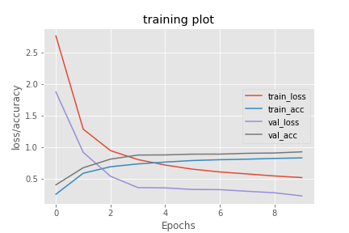

# Persian Letters and digits Classification

Classify handwritten persian letters and digit images.


## Summary 
This code will help you classify persian letters and digits with a accuary of 95.5% !

In this project I used 2 different datasets with different labeling.
- persian dataset that we created
- arabic dataset from [kaggle](https://www.kaggle.com/mloey1/ahcd1)

```extract.py ``` is used to extract data from datasets and catagorize them by folder.
I also used Data augmentation for creating more data for the model.


## Installation
I recommand using [Google colab](https://colab.research.google.com/) because training a model needs a lot of power and recources and also requirements are already installed.

But if you want to run it localy Run this to install requirements.

```
pip install -r requirements.txt
```
For this you must have [Python](http://python.org/) installed.


## Model 
This is the models architecture used for text classification in this project. 

```
Layer (type)                 Output Shape              Param #   
=================================================================
conv2d_120 (Conv2D)          (None, 26, 26, 32)        320       
_________________________________________________________________
batch_normalization_120 (Bat (None, 26, 26, 32)        128       
_________________________________________________________________
conv2d_121 (Conv2D)          (None, 24, 24, 32)        9248      
_________________________________________________________________
batch_normalization_121 (Bat (None, 24, 24, 32)        128       
_________________________________________________________________
conv2d_122 (Conv2D)          (None, 12, 12, 32)        25632     
_________________________________________________________________
batch_normalization_122 (Bat (None, 12, 12, 32)        128       
_________________________________________________________________
dropout_52 (Dropout)         (None, 12, 12, 32)        0         
_________________________________________________________________
conv2d_123 (Conv2D)          (None, 10, 10, 64)        18496     
_________________________________________________________________
batch_normalization_123 (Bat (None, 10, 10, 64)        256       
_________________________________________________________________
conv2d_124 (Conv2D)          (None, 8, 8, 64)          36928     
_________________________________________________________________
batch_normalization_124 (Bat (None, 8, 8, 64)          256       
_________________________________________________________________
conv2d_125 (Conv2D)          (None, 4, 4, 64)          102464    
_________________________________________________________________
batch_normalization_125 (Bat (None, 4, 4, 64)          256       
_________________________________________________________________
dropout_53 (Dropout)         (None, 4, 4, 64)          0         
_________________________________________________________________
conv2d_126 (Conv2D)          (None, 1, 1, 128)         131200    
_________________________________________________________________
batch_normalization_126 (Bat (None, 1, 1, 128)         512       
_________________________________________________________________
flatten_18 (Flatten)         (None, 128)               0         
_________________________________________________________________
dropout_54 (Dropout)         (None, 128)               0         
_________________________________________________________________
dense_18 (Dense)             (None, 42)                5418      
=================================================================
Total params: 331,370
Trainable params: 330,538
Non-trainable params: 832
_________________________________________________________________
```

## Evaluation
This is the accuracy and the loss for the model. 

Accuary: 95.5% 




## Author
[Parsa Mazaheri](https://github.com/parsa-mz)


## License
This project is licensed under the [GNU License](https://github.com/parsa-mz/Persian-Letters-and-Digits-Classification/blob/master/LICENSE).